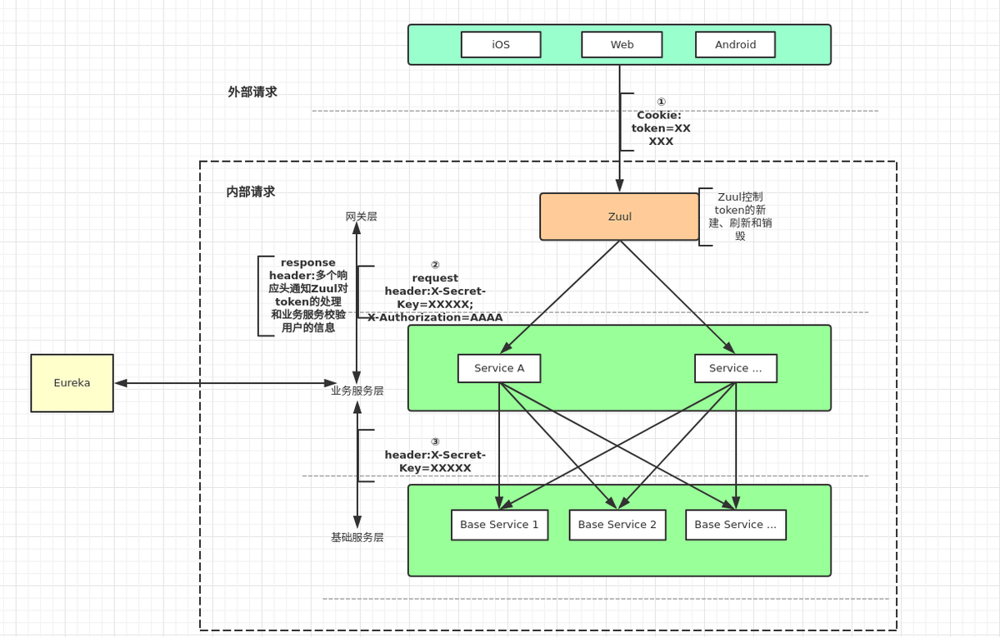
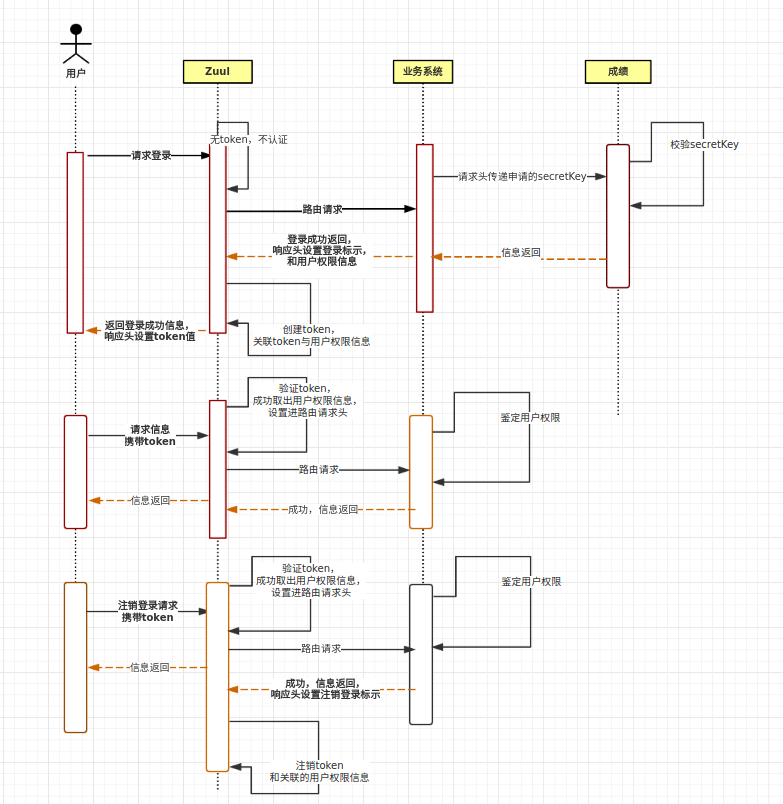

#### 微服务权限prototype

## 功能描述
用于测试和验证关于资源的权限和微服务的分布式权限架构开发的prototype工程。

## 认证/鉴权

这两个概念英文分别为`authentication`/`authorization` 。是不是特别容易混淆。无论你选择Apache Shiro 或者 Spring Security 都需要熟悉这两个概念。其实简单来说认证（authentication）就是为了证明`你是谁`，比如你输入账号密码证明你是用户名为`Felordcn`的用户。而授权（authorization）是通过认证后的用户所绑定的角色等凭证来证明`你可以做什么` 。打一个现实中的例子。十一长假大家远行都要乘坐交通工具，现在坐车实名制，也就是说你坐车需要两件东西：`身份证`和`车票` 。身份证是为了证明你确实是你，这就是 `authentication`；而车票是为了证明你张三确实买了票可以上车，这就是 `authorization`。这个例子从另一方面也证明了。如果只有认证没有授权，认证就没有意义。如果没有认证，授权就无法赋予真正的可信任的用户。两者是同时存在的。

## 项目结构
本项目使用intellij开发，可以用于eclipse，使用Maven多模块方式组织相关的依赖。

* eureka用于服务发现，http://localhost:7079
* zuul用于请求过滤和权限验证，http://localhost:7070/
* reporter用于模拟实际的资源服务，http://localhost:7071/

所有服务都集成了 actuator 模块便于收集和检测 http://localhost:{7079|7070|7071}/actuator

## 项目使用说明
**启动顺序**

1. 启动eureka用于服务发现
2. 启动zuul用于网关，同时完成基于Rest的请求权限验证。
3. 其它服务
    1. reporter用于演示业务
    2. author用于进行权限管理

问题：websocket 现在对ZUUL的支持文档并不多，有相关的文档表示可以使用，但有限制


## 权限实现方案及说明





采用 RBAC1 模型，结合spring security认证框架实现。


### Token编码方案对比

|          | JWT                      | Token          | OAuth    |
| -------- | ------------------------ | -------------- | -------- |
| 复杂度   | 中                       | 中低           | 高       |
| 注销问题 | 基于缓存来解决，或不解决 | 基于缓存来解决 | 联机验证 |
|          |                          |                |          |


## 示例说明

### 资源权限用例

1. 传统的用户能使用某些功能
2. 用户只能查看某功能中的特定数据
   1. 只能查看自己创建的数据
   2. 只能查看某个或多个人员分组下创建的数据
      1. 能查看某个人员分组以及人员分组下面分组的数据
   3. 能查看所有的数据

### 资源URI&API示例

**URI资源**定义举例

1. 所有的管理功能
   ALL /admin/**

2. 租方列表功能
   GET /admin/projects

3. 租方查询功能（查询条件）

   GET /admin/projets?q={query_string}&sort={xx}&order={desc|asc}
   eg: GET /admin/projets?q=东方+type:active+createDt>2019-01-03

4. 对租方A具体信息管理功能
   ALL /admin/projects/{001}

5. 租方A的所有功能/oms/**
   要求用户具有 001的数据访问权限

**用户角色权限抽像 /users** 

* 管理员admin可以看一下所有租方的相关数据和使用所有的管理功能

  ```json
  #管理功能的最高权限
  {
      "Statement": [
          {
              "Action": "admin:*",	# /admin/**
              "Effect": "Allow",
              "Resource": "*"
          }
      ],
      "Version": "1"
  }
  ```

* 租方A下面的用户a1只能访问自己租方下面的所有数据和所有租方功能

  ```json
  {
      "Statement": [
          {
              "Action": "oms:*",	# /oms/**
              "Effect": "Allow",
              "Resource": "001:*"
          }
      ],
      "Version": "1"
  }
  ```

* 租方A下面的用户a2只能自己租方下面的部分功能和所有数据

  ```json
  {
      "Statement": [
          {
              "Action": "oms:books:*",	# /books/**
              "Effect": "Allow",
              "Resource": "001:*"
          }
      ],
      "Version": "1"
  }
  ```

* 租方B下面的用户b1只能自己租方下面的部分功能和部分数据

  ```json
  {
      "Statement": [
          {
              "Action": "oms:items:*",	# /oms/items/**
              "Effect": "Allow",
              "Resource": "002:b01"
          }
      ],
      "Version": "1"
  }
  ```

* 租方B下面的用户b2只能自己租方下面的全部功能和全部数据
  这点是要担心的，当子数据描述增加时，针对访问全部的数据的要求，要以 * 来适配才好，不能变成需要同步的增加相应的权限这样很不方便

  ```json
  {
      "Statement": [
          {
              "Action": "oms:*",	# /oms/**
              "Effect": "Allow",
              "Resource": "002:*"
          }
      ],
      "Version": "1"
  }
  ```

* 租方B下面的用户b3只能自己租方下面的某功和某些数据
  这是最极端的例子，只访问部分个别的数据

  ```json
  {
      "Statement": [
          {
              "Action": "oms:items:*",	# /oms/items/**
              "Effect": "Allow",
              "Resource": ["002:b01","002:b03"]
          }
      ],
      "Version": "1"
  }
  ```


**用户及权限说明**

| user_name   | roles&authority |
| ----------- | --------------- |
| 用户a1      | {}              |
| 用户a2      |                 |
| 用户b1      |                 |
| 用户b2      | {}              |
| 用户b3      |                 |
| 管理员admin |                 |

**数据 项目信息 /porjects**

| res_auth_id | project_name |
| ----------- | ------------ |
| 001         | 武汉P4项目   |
| 002         | 上海P3项目   |

**数据 /books 无租方资源特殊子数据权限** 

| res_auth_id | book_name        |
| ----------- | ---------------- |
| 001         | 哈利波特         |
| 001         | 绿野仙踪         |
| 002         | 不可思议的爱丽丝 |

**数据 /items 租方资源特殊子数据权限** 

如果该数据资源有子数据权限要求，则增加一列用于描述子资源，同时可以使用资源描述符或标签来通配，如果该资源下面还有子资源，则需要再添加一列进行描述，命名方式以数据名 res_上一级的表_id

| res_auth_id | res_item_id | item_name |
| ----------- | ----------- | --------- |
| 001         | a01         | 医用口罩  |
| 002         | b01         | 3M 7501   |
| 002         | b02         | 松重 UK2  |
| 002         | b01         | 3M 5502   |
| 002         | b03         | 3M 7502QL |

select * from itesm where res_auth_id=001 and res_item_id=

#### Rest URI 

1. get 查看
   URL "user_search_url": "https://api.github.com/search/users?q={query}{&page,per_page,sort,order}”
   query = key:value+key:value
2. post 添加
3. put 幂等修改
4. patch 增量修改
5. delete 删除

* 针对只能查看自己创建的数据这样的需求，不建议使用权限系统来实现，使用定制独特的功能更好一点。

权限定义举例

```json
#最高权限
{
    "Statement": [
        {
            "Action": "*",
            "Effect": "Allow",
            "Resource": "*"
        }
    ],
    "Version": "1"
}
#系统只读
{
    "Version": "1",
    "Statement": [
        {
            "Action": [
                "*:Describe*",
                "*:List*",
                "*:Get*",
                "*:BatchGet*",
                "*:Query*",
                "*:BatchQuery*",
                "actiontrail:LookupEvents",
                "actiontrail:Check*",
                "dm:Desc*",
                "dm:SenderStatistics*",
                "ram:GenerateCredentialReport"
            ],
            "Resource": "*",
            "Effect": "Allow"
        }
    ]
}
#只充许操作某个资源
{
    "Statement": [
        {
            "Action": [
                "cs:Get*"
            ],
            "Effect": "Allow",
            "Resource": [
                "acs:cs:*:*:cluster/c28bc33a351db46c3bb94f0cdfadea0c6"
            ]
        }
    ],
    "Version": "1"
}
```


**用户角色权限抽像 users**

| user_name | roles&authority  |
| --------- | ---------------- |
| 王大      |                  |
| 李二      | 绿野仙踪         |
| 张三      | 不可思议的爱丽丝 |
|           |                  |


**数据 books **

| res_auth_id | book_name        |
| ----------- | ---------------- |
| 权限A       | 哈利波特         |
| 权限B       | 绿野仙踪         |
| 权限C       | 不可思议的爱丽丝 |


## 附录

### OAuth2

#### 角色

先区分下OAuth 2.0 中有哪些角色,阮一峰博客里写的更精确:
Client: 客户端,也就是Third-party application - 第三方应用程序
Service：服务端,也就是服务的提供者
User： 用户,也就是Resource Owner - 资源所有者
User Agent：用户代理,如浏览器，下文中将其与Client合并考虑。
Authorization Server：认证服务器,即服务提供商专门用来处理认证的服务器。
Resource Server：资源服务器,即服务提供商存放用户生成的资源的服务器。

### 客户端的授权模式

客户端必
须得到用户的授权（authorization grant），才能获得令牌（access token）。OAuth 2.0定义了四种授权方式。
授权码模式（authorization code）
简化模式（implicit）
密码模式（resource owner password credentials）
客户端模式（client credentials）

### AuthorizationServer 授权服务接口介绍

/oauth/authorize：验证接口， AuthorizationEndpoint
/oauth/token：获取token
/oauth/confirm_access：用户授权
/oauth/error：认证失败
/oauth/check_token：资源服务器用来校验token
/oauth/token_key：jwt模式下获取公钥；位于：TokenKeyEndpoint ，通过 JwtAccessTokenConverter 访问key

### JWT 简介

#### 规范

JWT – Json Web Token, 如其名，使用Json方式保存Web Token的协议。网上有各种解读，个人理解，这就是一个 客户端Session - Session保存在客户端，而不是通常的保存在服务端。

#### 构成

JWT三部分组成：

Header 头部：JSON方式描述JWT基本信息，如类型和签名算法。使用Base64编码为字符串
Payload 载荷:JSON方式描述JWT信息，除了标准定义的，还可以添加自定义的信息。同样使用Base64编码为字符串。
iss: 签发者
sub: 用户
aud: 接收方
exp(expires): unix时间戳描述的过期时间
iat(issued at): unix时间戳描述的签发时间
Signature 签名：将前两个字符串用 . 连接后，使用头部定义的加密算法，利用密钥进行签名，并将签名信息附在最后。

------------------------------------------------
版权声明：本文为CSDN博主「SophiaLeo」的原创文章，遵循 CC 4.0 BY-SA 版权协议，转载请附上原文出处链接及本声明。
原文链接：https://blog.csdn.net/Amor_Leo/article/details/101751690

**ZUUL也可以集成eureka和security用于 authorserver**

1. 

#### JWT令牌过期的处理方案

JWT因为是基于有实际意义的令牌的，所以可以做到网关不需要访问其它服务就能独立的进行鉴权，但是因此如果用户退出权限变化，这种先行验证的模式不能发现这些变化，解决的方案有很多。

1. 使用短时间的有效期频繁进行更新。
2. 一种方案是把令牌过滤层加入强制过期处理的。
3. 或者使用Redis的存储层进行存储


### 优点总结

1. yaml格式比 properties格式清晰，好用。
2. intellij 提交时的code analysis，有助于提高代码质量，减少低级错误。

### 问题总结

1. jdk 13 下使用 spring boot 会在启动时 warnning  eg: *WARNING: Please consider reporting this to the maintainers of org.springframework.cglib.core.ReflectUtils* 可以无视
2. intellij IDE 项目添加新的模块不能识
   **表现的形式为：**java目录并没有能在IDE中设置为代码目录，无法找到相关的依赖库。多次反复删除后创建才成功，原因未知。
   **解决方案：**删除无效的module后，再次使用 spring initialzr 来创建，创建后确认，spring service 面板中识别到了相关的启动项后，再修改 maven 配置。

### Docker环境配置

由于Docker环境的特殊的网络架构，相关的网络地址和端口需要在启动时注入或使用配置中心，下面是通过环境变量注入的示例。

**eureka application.yaml** 注意${}的部分是引入环境变量

```yaml
server:
  port: 8761  #注册中心的地址
spring:
  application:
    name: eureka-server
eureka:
  instance:
    hostname:  ${HOST}
    lease-renewal-interval-in-seconds: 1  #心跳检测检测时间,每间隔1s,向服务端发送一次心跳,表明自己依然”存活“
    lease-expiration-duration-in-seconds: 2 #续约时间,告诉服务端，如果我2s之内没有给你发心跳,就代表我“死”了,将我剔除
  server:
    enable-self-preservation: false #关闭自我保护机制
  client:
    service-url:
      defaultZone: ${EUREKA_SERVER_URL}
    register-with-eureka: false # 对于注册中心的优化,表明不向注册中心注册自己
    fetch-registry: false # 注册中心的优化，代表该注册中心服务，不拉取任何的服务列表
management:
  endpoints:
    web:
      exposure:
        include: "*"  #因为springboot2.1必须加上,支持访问/actuator/hystrix.stream
```

**docker file**

```dockerfile
FROM java:8-alpine
MAINTAINER "LHL <aomrlee412@gmail.com>" 
ADD *.jar app.jar
EXPOSE 8761
ENTRYPOINT ["java","-jar","/app.jar"]
```

**构建镜像**

```bash
docker build  ./eureka -t "eureka-server:1.0"
```

**运行镜像** 注意环境变量的注入

```bash
docker run --name eureka-server -p 8761:8761 -e EUREKA_SERVER_URL=http://192.168.0.110:8761/eureka -e HOST=192.168.0.110  -d  eureka-server:1.0
```

## 参考

https://spring.io

https://www.jianshu.com/p/f89f5557990f

https://blog.csdn.net/tianyaleixiaowu/article/details/77884778

https://blog.csdn.net/Amor_Leo/article/details/87873898

https://juejin.im/post/5c5e9c32f265da2dc706d6a7

https://felord.cn/categories/spring-security/page/2/

[zuul+security+oauth+jwt 英文](https://www.baeldung.com/spring-security-zuul-oauth-jwt)

[Using JWT with Spring Security OAuth](https://www.baeldung.com/spring-security-oauth-jwt)

[采用Zuul网关和Spring Security搭建一个基于JWT的全局验证架构](https://blog.csdn.net/daijinmingcn/article/details/79261610)