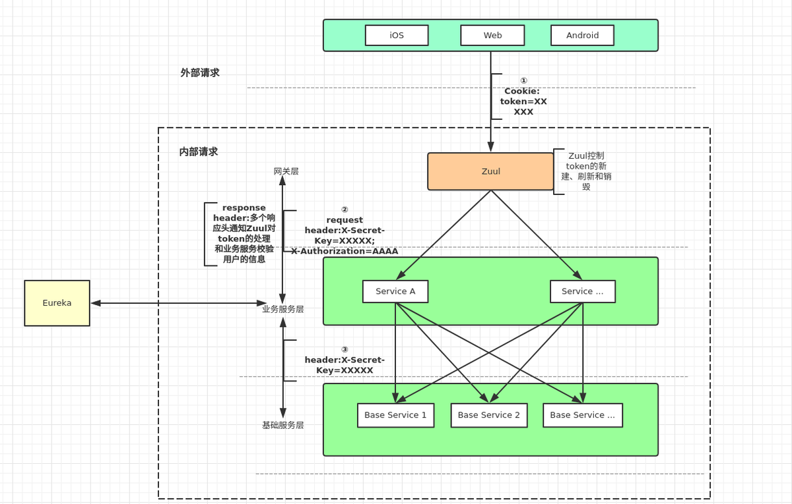

# 微服务权限prototype

## 功能描述
用于测试和验证关于资源的权限和微服务的分布式权限架构开发的prototype工程。
## 项目结构
本项目使用intellij开发，可以用于eclipse，使用Maven多模块方式组织相关的依赖。

* eureka用于服务发现，http://localhost:7079
* zuul用于请求过滤和权限验证，http://localhost:7070/
* reporter用于模拟实际的资源服务，http://localhost:7071/

所有服务都集成了 actuator 模块便于收集和检测 http://localhost:{7079|7070|7071}/actuator

## 权限实现方案及说明




采用 RBAC1 模型，结合spring security认证框架实现。


1. 

## 附录

### 优点总结

1. yaml格式比 properties格式清晰，好用。
2. intellij 提交时的code analysis，有助于提高代码质量，减少低级错误。

### 问题总结

1. jdk 13 下使用 spring boot 会在启动时 warnning  eg: *WARNING: Please consider reporting this to the maintainers of org.springframework.cglib.core.ReflectUtils* 可以无视
2. intellij IDE 项目添加新的模块不能识
   **表现的形式为：**java目录并没有能在IDE中设置为代码目录，无法找到相关的依赖库。多次反复删除后创建才成功，原因未知。
   **解决方案：**删除无效的module后，再次使用 spring initialzr 来创建，创建后确认，spring service 面板中识别到了相关的启动项后，再修改 maven 配置。

### Docker环境配置

由于Docker环境的特殊的网络架构，相关的网络地址和端口需要在启动时注入或使用配置中心，下面是通过环境变量注入的示例。

**eureka application.yaml** 注意${}的部分是引入环境变量

```yaml
server:
  port: 8761  #注册中心的地址
spring:
  application:
    name: eureka-server
eureka:
  instance:
    hostname:  ${HOST}
    lease-renewal-interval-in-seconds: 1  #心跳检测检测时间,每间隔1s,向服务端发送一次心跳,表明自己依然”存活“
    lease-expiration-duration-in-seconds: 2 #续约时间,告诉服务端，如果我2s之内没有给你发心跳,就代表我“死”了,将我剔除
  server:
    enable-self-preservation: false #关闭自我保护机制
  client:
    service-url:
      defaultZone: ${EUREKA_SERVER_URL}
    register-with-eureka: false # 对于注册中心的优化,表明不向注册中心注册自己
    fetch-registry: false # 注册中心的优化，代表该注册中心服务，不拉取任何的服务列表
management:
  endpoints:
    web:
      exposure:
        include: "*"  #因为springboot2.1必须加上,支持访问/actuator/hystrix.stream
```

**docker file**

```dockerfile
FROM java:8-alpine
MAINTAINER "LHL <aomrlee412@gmail.com>" 
ADD *.jar app.jar
EXPOSE 8761
ENTRYPOINT ["java","-jar","/app.jar"]
```

**构建镜像**

```bash
docker build  ./eureka -t "eureka-server:1.0"
```

**运行镜像** 注意环境变量的注入

```bash
docker run --name eureka-server -p 8761:8761 -e EUREKA_SERVER_URL=http://192.168.0.110:8761/eureka -e HOST=192.168.0.110  -d  eureka-server:1.0
```

## 参考

https://spring.io

https://www.jianshu.com/p/f89f5557990f

https://blog.csdn.net/tianyaleixiaowu/article/details/77884778

https://blog.csdn.net/Amor_Leo/article/details/87873898